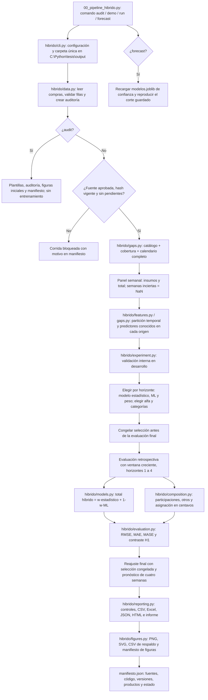

# Flujo del pipeline híbrido para la predefensa

## Idea central

El sistema pronostica el **importe nominal semanal de compras registradas y utilizables** y después distribuye ese total entre insumos mediante participaciones estimadas. El total combina un modelo estadístico y uno de aprendizaje automático (ML). La composición es un modelo separado: no debe confundirse el pronóstico del total con la asignación por insumo.

Las semanas sin cobertura suficiente permanecen en el calendario como faltantes. El pipeline no supone que una semana sin registros sea una semana de gasto cero, ni que las compras registradas representen necesariamente todo el gasto de la empresa.

## Diagrama de extremo a extremo



`demo` sigue el mismo flujo de entrenamiento que `run`, pero genera datos sintéticos aislados y marca sus salidas como demostración. **No es evidencia empírica de la tesis.**

## Qué hace cada archivo activo

| Archivo | Explicación para exponer |
| --- | --- |
| `00_pipeline_hibrido.py` | Entrada única; pasa los argumentos a la interfaz. |
| `01_normalizacion.py` | Limpia espacios y acentos en descripciones; no asigna insumos automáticamente. |
| `02_config_hibrido.json` y `hibrido/config.py` | Fijan fuente, hash, periodo, horizontes, corte final y opciones; rechazan una configuración incoherente. |
| `hibrido/cli.py` | Coordina comandos, crea una carpeta nueva de salida y escribe el manifiesto aun si la corrida falla. |
| `hibrido/data.py` | Lee compras y fuentes opcionales; separa registros utilizables de pendientes y conserva duplicados expresamente aprobados. |
| `hibrido/gaps.py` | Une catálogo y cobertura con el calendario; mantiene semanas inciertas como faltantes y construye características sin mirar el futuro. |
| `hibrido/features.py` | Expone los nombres públicos de las funciones temporales de `gaps.py`; no duplica lógica. |
| `hibrido/models.py` | Ajusta candidatos estadísticos y ML; informa fallos de componentes; calcula referencias simples. |
| `hibrido/composition.py` | Elige insumos principales, estima participaciones y reparte el total exactamente en centavos. |
| `hibrido/experiment.py` | Selecciona con validación interna, evalúa con fechas posteriores, ajusta el modelo final y guarda su emisión. |
| `hibrido/evaluation.py` | Calcula errores monetarios, de composición y diferencias de pérdidas para H1. |
| `hibrido/reporting.py` | Ejecuta controles y crea JSON, tablero HTML e informe interpretativo. |
| `hibrido/figures.py` | Genera figuras con sus datos de respaldo; registra explícitamente figuras omitidas. |

## Recorrido explicable en la exposición

1. **Auditoría de entradas.** Se lee la fuente aprobada, se comprueba su SHA-256, se normalizan las descripciones y se identifican fechas, importes o descripciones inválidos. Las filas pendientes bloquean el entrenamiento. Las plantillas de catálogo y cobertura son propuestas para revisión humana, no aprobaciones automáticas.
2. **Definición del alcance.** El catálogo documenta qué descripciones se incluyen y a qué `insumo_id` pertenecen. La cobertura indica, por cada lunes, si la semana es utilizable. El panel suma importes por insumo y agrega `total`; una semana incierta queda completamente ausente.
3. **Separación temporal.** Las últimas 26 semanas calendario de la configuración real forman la evaluación final. Ocho orígenes anteriores sirven para validación interna. Las etiquetas de todos los horizontes internos terminan antes del corte final. En cada origen solo se usan compras y fuentes opcionales conocidas hasta esa fecha (`available_at`).
4. **Selección dentro de desarrollo.** Para cada horizonte `h=1,2,3,4`, se comparan componentes estadísticos (SARIMAX AR(1), ARIMA(1,1,1), SES, Holt amortiguado y naive estacional) con HistGradientBoosting, Random Forest, Ridge y MLP. Incluye correctores residuales RF y MLP sobre ARIMA, entrenados con errores de pronósticos de origen móvil fuera de muestra. El peso de la combinación se elige en validación interna. La composición usa una historia independiente, con promedio histórico como referencia y promedio exponencial como candidato. Las categorías principales se fijan con el desarrollo; el remanente elegible se registra como `RESTO_ELEGIBLE`, distinto de la categoría fuente excluida `OTROS`.
5. **Evaluación final.** Se recorre la prueba con historia creciente. Por origen y horizonte se calcula el total híbrido, se compara con componentes y referencias, se estiman participaciones y se asigna el presupuesto. Esta prueba mide decisiones **ya elegidas**; no se usa para escoger un ganador nuevo.
6. **Métricas e hipótesis.** El importe elegible se evalúa con RMSE, MAE y MASE. La composición principal se evalúa con MAE en puntos porcentuales por insumo y promedio macro, respecto al total elegible. H1 se examina en `h=1` mediante diferencias emparejadas de pérdida monetaria frente a último valor y de error de composición frente a promedio histórico. Los intervalos por bootstrap de bloques son **exploratorios**, no una confirmación independiente.
7. **Emisión y trazabilidad.** Con las configuraciones congeladas se reajustan los componentes sobre la historia disponible y se pronostican cuatro semanas. El CSV de cuatro semanas consolida MXN por insumo y calcula el porcentaje monetario del periodo; no se presenta como modelo independiente de mes calendario. `modelos.joblib` guarda el corte; se recarga para comprobar que reproduce la misma emisión. Los controles verifican conciliación, suma de asignaciones, participaciones, no negatividad, exclusiones presupuestarias, recarga y cuatro horizontes. Finalmente se exportan tablas, figuras y un manifiesto con hashes.

## Guion breve para decirlo en voz alta

> Primero audito las compras y verifico que la fuente no haya cambiado. Después cruzo cada descripción con un catálogo aprobado y cada semana con evidencia de cobertura. Mantengo los huecos en el calendario para no convertir falta de información en ceros. Separo temporalmente desarrollo y evaluación: selecciono componentes, pesos y composición solo en el tramo de desarrollo. En la prueba retrospectiva proyecto el total con una combinación estadística y ML, estimo el porcentaje de cada insumo y reparto el presupuesto exactamente en centavos. Comparo errores con referencias sencillas y estudio H1 de forma exploratoria. Por último, guardo modelo, datos, figuras, controles y hashes para que la corrida sea reproducible y auditable.

## Preguntas previsibles del jurado

- **¿Dónde está lo híbrido?** En el pronóstico del total: `w × estadístico + (1-w) × ML`, con un peso elegido por horizonte en validación interna. La composición es una segunda etapa de distribución.
- **¿Hay fuga de información?** Las particiones respetan el tiempo; las características miran solo la historia previa y las fuentes opcionales se filtran por `available_at`. La configuración se congela antes de la evaluación final.
- **¿Qué ocurre con semanas sin registros?** No se declaran automáticamente como gasto cero. Si la cobertura es incierta, siguen como `NaN` en su lunes original.
- **¿El modelo demuestra H1?** El código reporta diferencias e intervalos exploratorios. No afirma respaldo confirmatorio independiente, aunque una comparación resulte favorable.
- **¿Cómo se reproduce?** Misma configuración y fuentes aprobadas, semilla fija, versiones y hashes en el manifiesto. `forecast` reproduce el corte guardado; para un nuevo corte se requiere otra corrida `run`.

## Ejecución manual

Desde `C:\Python\tesis\codigos`, con las dependencias instaladas:

```powershell
.\.venv\Scripts\python.exe .\00_pipeline_hibrido.py audit --config .\02_config_hibrido.json
.\.venv\Scripts\python.exe .\00_pipeline_hibrido.py run --config .\02_config_hibrido.json
.\.venv\Scripts\python.exe -m unittest discover -s tests -p 'test_hibrido*.py' -q
```

Cada ejecución crea una carpeta distinta bajo `C:\Python\tesis\output`. Para una demostración aislada se usa `demo`; para volver a emitir un modelo guardado se usa `forecast --artifact RUTA_AL_MODELO`, únicamente con un artefacto de confianza.
